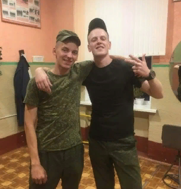

# **Dominik Stupnikov**

## **Contact information:** 

* Location: Minsk,Belarus
* Phone: +375 29 3257387
* Email: statirgold@mail.ru
* Telegram: @stupnikof
* Discord: DominikStupnikov#1081
* GitHub: [DominikStupnikov](https://github.com/DominikStupnikov)
* Instagram: [dominik_stupnikov](https://www.instagram.com/dominik_stupnikov/)

## **Briefly About Myself:**
My name is Dominic, I am 23 years old. I live in Minsk.

He graduated from the 9th grade, then entered the College of Commerce, received the specialty of a salesman. After graduating from college, he entered the second stage of education. Work experience since high school, worked there as a maintenance worker. After graduating from college, he worked as a salesman in a Department store Belarus. After leaving the department store, I went to work in a call center, I worked there for a short time due to the fact that I was taken into the army. After the army, he got a job at Yandex Taxi. I'm not studying anywhere at the moment.

I want to study a new profession Frontend developer and further connect my life with it.
## Skills:

## Code Examples:

## Work experience:

## Education:
* College of Commerce
* RS Schools Course «JavaScript/Front-end. Stage 0» (in progress)

## Languages:
* English proficiency level - beginner 
* Russian - Native